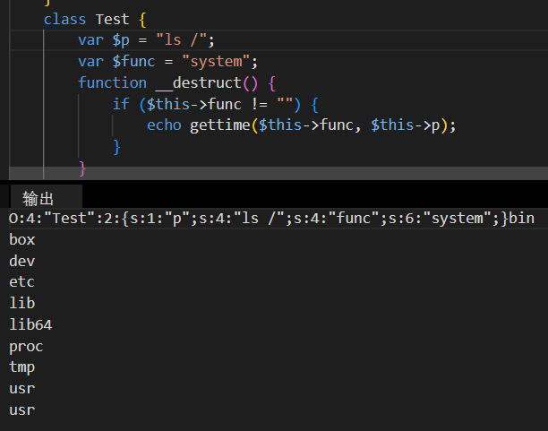
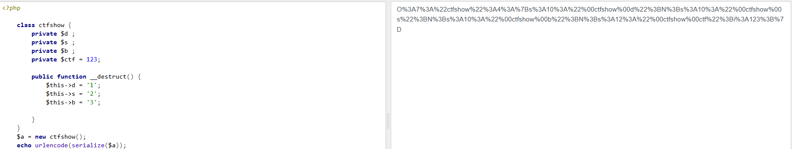
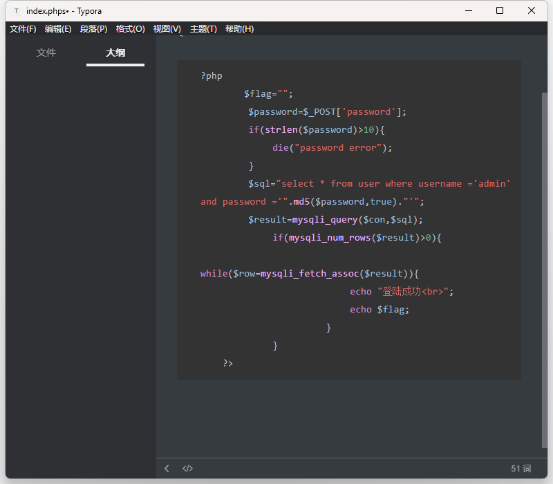
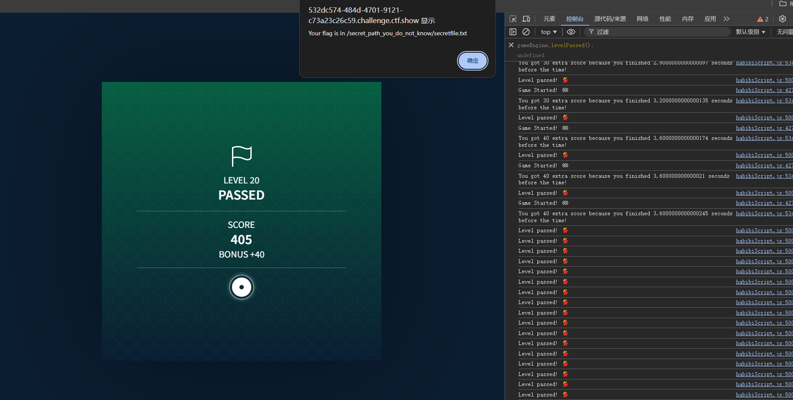
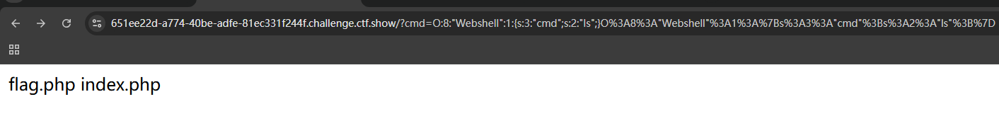

## 121.[ZJCTF 2019]NiZhuanSiWei


先绕过前两个 构造payload

?text=data://text/plain,welcome to the zjctf&file=php://filter/read=convert.base64-encode/resource=useless.php


解码后

根据源代码 file赋值为flag.php

然后file去掉协议 与include函数匹配


## 122.[网鼎杯 2020 朱雀组]phpweb


网页没过一段时间会刷新 那就抓包 等刷新后拿到信息

随便改一下数据 报错中有信息

学习此函数

学习此函数的漏洞利用后 尝试利用assert等都显示hack 即被过滤 最后file_get_contents能用

```php
<?php
    $disable_fun = array("exec","shell_exec","system","passthru","proc_open","show_source","phpinfo","popen","dl","eval","proc_terminate","touch","escapeshellcmd","escapeshellarg","assert","substr_replace","call_user_func_array","call_user_func","array_filter", "array_walk",  "array_map","registregister_shutdown_function","register_tick_function","filter_var", "filter_var_array", "uasort", "uksort", "array_reduce","array_walk", "array_walk_recursive","pcntl_exec","fopen","fwrite","file_put_contents");
    function gettime($func, $p) {
        $result = call_user_func($func, $p);
        $a= gettype($result);
        if ($a == "string") {
            return $result;
        } else {return "";}
    }
    class Test {
        var $p = "Y-m-d h:i:s a";
        var $func = "date";
        function __destruct() {
            if ($this->func != "") {
                echo gettime($this->func, $this->p);
            }
        }
    }
    $func = $_REQUEST["func"];
    $p = $_REQUEST["p"];

if ($func != null) {
    $func = strtolower($func);
    if (!in_array($func,$disable_fun)) {
        echo gettime($func, $p);
    }else {
        die("Hacker...");
    }
}
?>


```


去序列化


放入repeater后 找不到flag 用命令find / -name flag*


cat打开

解


## 123.find_it


查看robots协议

查看.1ndexx.php.swp

写入hack.php?code=<?php%20show_source(__FILE__);?>

hack里就有文件

或者写入木马 打开蚁剑


## 124.ctfhub 文件上传 无验证


php一句话挂马

#### @符号

@符号表示后面的语句即使执行错误，也不报错。

#### eval()[函数](https://marketing.csdn.net/p/3127db09a98e0723b83b2914d9256174?pId=2782?utm_source=glcblog&spm=1001.2101.3001.7020)

eval()函数的作用是把括号内的字符串全部当作php代码来执行。

$_POST['hack']
post方法是html中<form>标签中的方法，在页面中，所有的POST方法都会由submit输入方式向action中的php文件返还信息，通常这样的php文件是连着着数据库的，甚至可以直接对文件进行操作。当使用<form>标签的post方法时候，同时<form>标签里面的name属性等于hack

例如：


会在php文件中产生一个$_POST[cmd]变量，变量中储存有用户提交的数据。


蚁剑链接后打开目录找到flag


## 125.ctfhub 文件上传  前端验证


查看源码 只能上传.jpg .png .gif


改一下后缀，上传成功后 再抓包把png后缀去掉就绕过了前端


打开蚁剑找flag


## 126.文件上传 .htaccess

htaccess文件是Apache服务器中的一个配置文件，它负责相关目录下的网页配置。通过htaccess文件，可以帮我们实现：网页301重定向、自定义404错误页面、改变文件扩展名、允许/阻止特定的用户或者目录的访问、禁止目录列表、配置默认文档等功能

先上写一句命令：通过编辑.htaccess文件将**特定后缀的文件解析为PHP执行**

因为 .htaccess 是配置文件，所以文件名就是.htaccess不能随便改

上传

再把php马后缀改为png上传

打开蚁剑即可


## 127.文件上传 MIME绕过

MIME：当文件的扩展名是用一种应用程序来打开的方式类型，当扩展名文件被访问的时候，浏览器会自动指定应用程序来打开。语法：type/subtype （大类型/小类型）

通俗点就是，

当我们上传的文件被判定为content-type字段时，可以通过抓包，将content-type字段改为常见的图片类型，例如inamge/gif，从而绕过。

也就是我们上传php文件时，可以改为jpg、png之类的，然后实现绕过。


抓包

把content—Type改一下

然后发包 提示上传成功 用蚁剑链接找到flag


## 128.文件上传 00截断

原理：%00，0x00，/00都属于00截断，利用的是服务器的解析漏洞（ascii中0表示[字符串](https://so.csdn.net/so/search?q=字符串&spm=1001.2101.3001.7020)结束），所以读取字符串到00就会停止，认为已经结束。

在url中 %00 表示ascll码中的 0 ，而ascii中0作为特殊字符保留，表示字符串结束，所以当url中出现%00时就会认为读取已结束。

0x00是字符串的结束标识符，攻击者可以利用手动添加字符串标识符的方式来将后面的内容进行截断，而后面的内容又可以帮助我们绕过检测。
数据包中必须含有上传后文件的目录情况才可以用，比如数据包中存在path: uploads/，那么攻击者可以通过修改path的值来构造paylod: uploads/aa.php%00


先在源代码里找到白名单

更改shell后缀为png并上传抓包

改一下payload 加上shell.php%00 放包

蚁剑链接shell.php找到flag


## 129.文件上传 双写后缀

查看源代码

有黑名单过滤

上传shell.php发现后缀没了

抓包 双写绕过(pphphp) 放包 蚁剑连接　


## 130.文件上传 文件头检查

上传php文件 跳出提示

上传shell.php.png上传


介绍：图片的文件头：GIF89a


## 131.A1 GET & POST


## 132.A1 ez_md5


强比较弱比较 数组绕过

## 133.A1ez_jump


根据题目提示 想看看控制台网络 能不能抓到什么

抓包 送到repeater 去掉hello.php


## 134.A1 游戏启动！


是一个盖楼游戏

试试前端改分数，但打开源码 查找6666 看到alert函数 直接解码 拿到flag


## 135.A1  ez_eval


控制台里找到hint 查看文件

rce注入


那就直接连蚁剑

## 136.A1 ez_include


### 非法字符传参

当`PHP版本小于8`时，如果参数中出现中括号`[`，中括号会被转换成下划线`_`，但是会出现转换错误导致接下来如果该参数名中还有`非法字符`并不会继续转换成下划线`_`，也就是说如果中括号`[`出现在前面，那么中括号`[`还是会被转换成下划线`_`，但是因为出错导致接下来的非法字符并不会被转换成下划线`_`

所以构造payload :?php[in.fo=114514

题目提示文件包含漏洞


## 137.[2022 A1CTF]Diana的身高


审计代码 只要num绕过is_numeric()并弱比较==180即可

这里采用%00绕过或者180后面随便加个字母

根据提示flag再cookie里


## 138.A1 PHP_UNSERIALIZE ( 1 )

这题应该是反序列化 但是奇怪直接抓包有flag‘

但提交发现是假的 

dirsearch扫描发现有泄露

看看里面有什么

打开网址后下载www.zip


找到反序列化文件 

post传参

cat打开


## 139.A1 PHP_UNSERIALIZE ( 2 )

pop链


最后cat  /flag打开

或者这么写

```php
$a=new ctf(null,null);
$a->name=new welcome();
$a->name->web=new world();
$d=serialize($a);
echo $d;
```


## 140.A1 when they cry


第一层绕过 利用intval()函数的截断 kiseki=586.1即可

第二层 preg_match匹配函数 ^表示从头开始 $表示结尾 这里用换行符绕过：rena=miracle%0a


第三层过滤了b|c|h|j|k|m|o|p|q|r|s|u|v|w|x|y|z|>|\*|\?这些字符且大小写不敏感

?kiseki=586.1&rena=miracle%0a&cmd=a


## 141.A1 ez_upload


先上传写有php木马的png文件 然后提示我

爆破


；链上蚁剑 找flag


## 142.签到·好玩的PHP

### 序列化




## 143 web3

### php://input


## 144.web2

### sql


## 145.web4

直接猜flag的话也是能猜到 后面看看能不能正确解

尝试php和data协议都被过滤 回显erro

日志包含漏洞的成因还是服务器没有进行严格的过滤 ，导致用户可以进行任意文件读取，

但是前提是服务器需要开启了记录日志的功能才可以利用这个漏洞。

对于Apache，日志存放路径：/var/log/apache/access.log

对于Ngnix，日志存放路径：/var/log/nginx/access.log 和 /var/log/nginx/error.log

中间件的日志文件会保存网站的访问记录,比如HTTP请求行,User-Agent,Referer等客户端信息，如果在HTTP请求中插入恶意代码,那么恶意代码就会保存到日志文件中,访问日志文件的时候，日志文件中的恶意代码就会执行,从而造成任意代码执行甚至获取shell。

这里是中间件是Nginx：

Nginx中的日志分两种，一种是error.log，一种是access.log。error.log可以配置成任意级别，默认级别是error，用来记录Nginx运行期间的处理流程相关的信息；access.log指的是访问日志，用来记录服务器的接入信息（包括记录用户的IP、请求处理时间、浏览器信息等）。


查看/etc/passwd

查看?url=/var/log/nginx/access.log

发现会读入UA那就在UA写入一句话木马 链接蚁剑


## 146 web5

0e绕过


## 147.web6

输入空格报错 过滤了空格


%09绕过


## 148.web7


过滤空格


## 149.web9


万能密码也没用 没思路先扫一下




ffifdyop绕过

## 

## 150.web10

源码


我们发现很多关键字` $regex = "/(select|from|where|join|sleep|and|\s|union|,)/i";`都被过滤掉了，那么常规注入就不可行了，而且账户密码都进行了过滤，那么我们啥也不知道，那么怎么办呢？可以使用`with rollup`使密码为空，然后进行绕过。

```
'or/**/1=1/**/group/**/by/**/password/**/with/**/rollup#
```

3.注入登录，登录成功得到flag。

## 151.web11


那输入的密码与sessio都为空即可


## 152.web12


glob() 函数返回一个包含匹配指定模式的文件名或目录的数组。


## 153.web签到


## 154.我的眼里只有$


`extract ()`： 从数组中将变量导入到当前的符号表 。

`extract($_POST);`： 将post上来的数据直接都解析成变量的形式，在代码中可以直接使用


## 155.抽老婆

session伪造

## 156.一言既出

闭合绕过


## 157.驷马难追

114514+1805296


## 158.TapTapTap


查看源代码 找到增加关卡的函数

前端更改


## 159.Webshell




过滤了flag  *绕过


## 160.化零为整


 count($_ GET) 的意义是获取get的参数个数 ， $result=$result.$_ GET[$i]：拼接字符串

?1=%E5&2=%A4&3=%A7&4=%E7&5=%89&6=%9B


